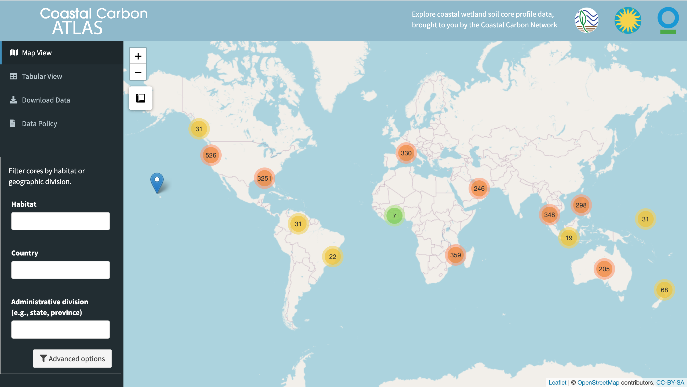

This is a web application designed to visualize, query, and download data from the Coastal Carbon Data Library. The Atlas was launched on Feb 22, 2019 and version 2 is about to debut. Access the Atlas here:

### [The Coastal Carbon Atlas](https://ccrcn.shinyapps.io/CoastalCarbonAtlas/)

<!-- <body style="margin:0px;padding:0px;overflow:hidden"> -->
<!-- <iframe src="https://ccrcn.shinyapps.io/CoastalCarbonAtlas/" frameborder="0" style="overflow:hidden;height:100%;width:100%" height="100%" width="100%"></iframe> -->
<!-- </body> -->

<!-- <iframe src="https://ccrcn.shinyapps.io/CoastalCarbonAtlas/" style="width:100vw;height:100vh;"></iframe> -->

<!-- 
 -->

### Accessing the Atlas

<iframe width="840" height="472.5" src="https://www.youtube.com/embed/sEcu1kZAs-o" title="YouTube video player" frameborder="0" allow="accelerometer; autoplay; clipboard-write; encrypted-media; gyroscope; picture-in-picture" allowfullscreen></iframe>

<!-- Original width: 560; original height: 315 -->