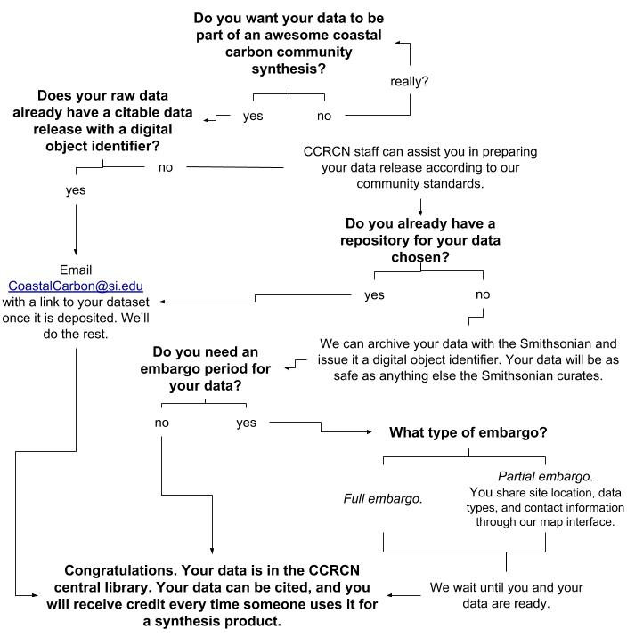

Data sharing is a fundamental part of the Coastal Carbon Network's (CCN) goal to increase data discovery and access in coastal wetland carbon science. Our Network serves as a global convener of coastal blue carbon data, and we seek to make sure that the information which we are serving reflects the scope and investment of the research community. Our Network data sharing activities are based on trust, and it is important that we maintain the provenance of every dataset and provide credit to every researcher who produced it. Read more on these values [here](https://smithsonian.github.io/CCN-Community-Resources/usepolicy.html).

### Why Contribute Data?

-   **It will increase the likelihood that your data will be included in future syntheses.** This means more citations, more collaborations, and more publicity of your work. We can also advertise your data to the community through the [Coastal Carbon Atlas](https://ccrcn.shinyapps.io/CoastalCarbonAtlas/).
-   **The CCN is nested under the Smithsonian, a trusted institution with a legacy of long-term archival.** The Smithsonian has a long history of archiving physical and digital content, as well as high visibility and recognition. Submitting data to the CCN will enable you to release your dataset with a unique digital object identifier (DOI), which can be embargoed and versioned. This data product is stored in one of the Smithsonian Library's trusted [digital repositories](https://library.si.edu/research/data-repositories), which is typically [Figshare](https://smithsonian.figshare.com/).
-   **Our Data Library is targeted to the coastal carbon community and receptive to feedback.** Because our focus is specialized, as opposed to a more general data repository, our vocabulary and structure is catered to those engaged in coastal carbon science, and we have the capability to quickly respond to new developments and recommendations through our version-controlled [database structure](https://smithsonian.github.io/CCN-Community-Resources/soil_carbon_guidance.html).
-   **We have full-time staff dedicated to assisting the data curation and archival process.** Our staff are happy to assist the process of reformatting data and providing the affiliated licensing and DOI for your data release.
-   **You decide when and how the data are released to the public.** If CCN personnel are assisting you in the assembly of a data release, we ensure that the data remain private until permission is granted by the participating author(s). We can also ensure that the data are not made public before a certain date by establishing a full (data and metadata) or partial (data only) embargo. Although our default data repository is the research-orientated Figshare, we are able to assist with data releases that will be deposited in other locations, such as a data bank designated by your funding sources.

### How to Contribute

We welcome contributions of carbon data from coastal wetland habitats that experience tidal influence (or are anticipated to the future). We accept data that is published or unpublished as long as the original measurements are or can be made available. If you are interested in contributing data, please email [CoastalCarbon\@si.edu](mailto:CoastalCarbon@si.edu) and CCN personnel will assist you in the process. We also encourage you to make a submission to our [Coastal Carbon Data Discovery](https://docs.google.com/spreadsheets/d/1e9_Dv8XzrPrHcNnOlQM2R2H1tRc3LoKCeWNqsGgoq9w/edit?usp=sharing) form.

We take a flexible approach when it comes to data contribution, which can require more or less participation on the part of the data contributor. If a dataset already has a citable data publication, we do the work to bring the dataset into our synthesis (with attribution), communicating with the corresponding author(s) to ensure that the dataset is well-documented.

If the data is unpublished, we can first work with the data contributor to prepare a standalone citable publication for the complete dataset. Unpublished data can remain unpublished or embargoed for a duration specified by the submitter. When the embargo period ends, the data release is made public, the dataset is drawn into CCN synthesis products, and becomes discoverable through the Coastal Carbon Atlas. A bibliography is associated with every synthesized dataset to ensure that the original sources and dataset authors are attributed.

**CCN Data Synthesis Workflow**

The following diagram provides a visual representation of how contributed data is curated and brought into the synthesis.

### Data Publishing Support

In addition to synthesizing and serving open-source data, the CCN offers publishing support and guidance to the research community. The support we offer for data publication ranges from consultation to hands-on data release assembly. In either case, the CCN aims to facilitate the independent publication of well-documented datasets which credits the authors of the data and assigns a stable DOI. We work to educate dataset authors about the data archival process and the information that they will need to provide to ensure that their dataset is well-represented and usable.

A CCN-prepared data release will be assembled with proper documentation and shared with the corresponding author via a private link for review.

### Data Standards

The CCN has developed guidance with community feedback for the standardization of information which is collected from coastal wetlands. We currently offers data-structuring guidance for the following types of data: [soil carbon](https://smithsonian.github.io/CCN-Community-Resources/soil_carbon_guidance.html), chamber-based greenhouse gas flux, soil pore water, and biomass.

We offer the option for the authors to fill out data templates containing table-specific glossaries. Templates for data entry can currently be downloaded from the [CCRCN Data Templates](https://drive.google.com/drive/folders/14N-7l1s151Qmp4AqQOWtIeMtc3efsYZT?usp=sharing) folder on Google Drive. These may also be used as a more general reference for data structuring.

Please note: Our goal is to meet our data contributors where they are in terms of the time and effort they can put toward aligning their datasets to the CCN database structure and create a data product that best-represents their data within the context of their study.

### Testimonials

"The Coastal Carbon Research Coordination Network dataset has been invaluable in our recent research identifying global drivers of variability in coastal wetland carbon cycling. The Network's dataset greatly complemented our own previous data collation efforts, filling important gaps in our record. The availability of a comprehensive and well-curated dataset allowed us to focus on the analysis and interpretation of data, deriving important new insights in global patterns of carbon storage."

\- *Jeffrey Kelleway, Department of Environmental Sciences, Macquarie University*

"The CCRCN database is a key cornerstone in accelerating the pace of discovery for coastal carbon cycling. I recently downloaded version 1, and have begun analylzing it and intercomparing its features with other national and global sets on soil core characteristics. As it focuses only on soilcores from tidal wetland, it is the single largest and spatially explicit empirical dataset, globally, for populating carbon stock assessments or testing models across space and time. For coastal lands, it is an invaulable asset for scientists and managers alike.  The developers of the dataset and platform should be commended, as should the many community contributors who are fueling advances in science and practice by sharing their data."

"[The CCRCN administrators] are doing an amazing job at this organization and promoting inclusivity. I am floored by your intuition and abilities. You are the natural heirs to this community-building."

\- *Lisamarie Windham-Myers, U.S. Geological Survey*
