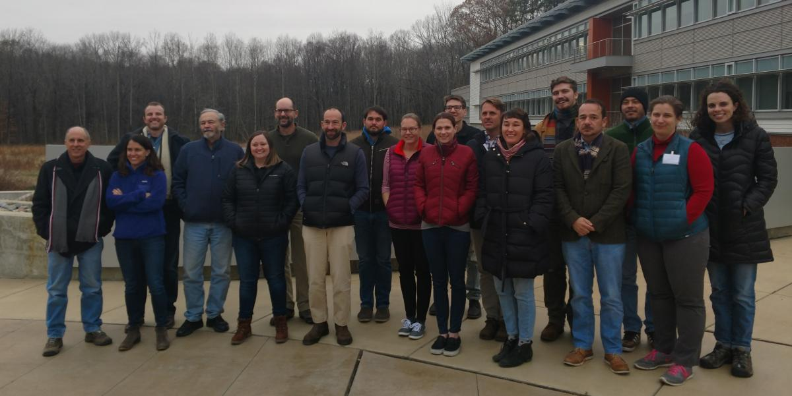
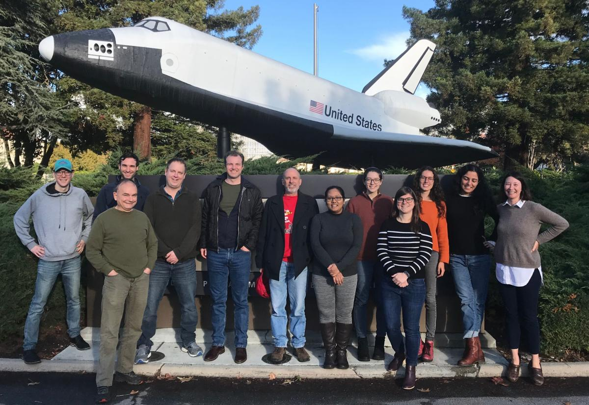

## Soil Carbon Working Group

This topical working group seeks to improve measuring, reporting, modeling, and mapping of soil carbon burial rates and carbon stocks in coastal wetlands.

**Research Questions**

- What is the potential for pairing Bayesian statistical methods with process-based modeling to map carbon stocks and sequestration rates?

- How much variation in carbon stocks and burial rates is attributable to field and lab techniques, and how much to process uncertainty?

**(Anticipated) Project Milestones**

1. Paper on modeling and forecasting soil carbon sequestration rates
2. Papers on best practices for field, lab, and data management
3. Open-source R package(s) of marsh equilibrium models
4. Mapped products at the scale of the contiguous United States if applicable

## Methane Working Group

This topical working group seeks to improve predictions of methane emissions from coastal wetlands. Specifically, we aim to compile all methane flux data from coastal habitats (not mangroves) in the contiguous United States to parameterize and validate a set of nested process-based CH4 models.

**Research Questions:**

- How well can we predict methane emissions from coastal wetlands? In other words, what are the main sources of error? What types of wetlands are the most difficult to model (along spectrum of salinity, disturbance/age, plant community etc.)
- What data streams are needed to improve our predictions?
- Can our process-based models predict interannual variability? If not, why? How does this influence predictions of CH4 budgets in the future?
- What guidance can we give to the science and management communities based on these efforts?