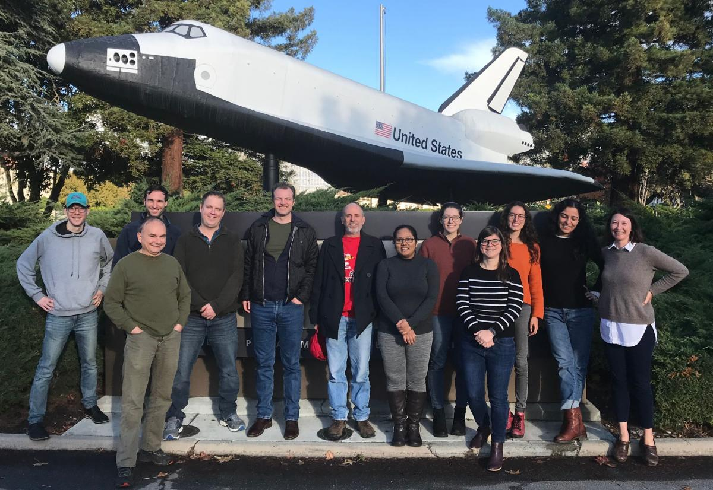

This topical working group seeks to improve predictions of methane emissions from coastal wetlands. Specifically, we aim to compile all methane flux data from coastal habitats (not mangroves) in the contiguous United States to parameterize and validate a set of nested process-based CH4 models.

## Research Questions:

- How well can we predict methane emissions from coastal wetlands? In other words, what are the main sources of error? What types of wetlands are the most difficult to model (along spectrum of salinity, disturbance/age, plant community etc.)
- What data streams are needed to improve our predictions?
- Can our process-based models predict interannual variability? If not, why? How does this influence predictions of CH4 budgets in the future?
- What guidance can we give to the science and management communities based on these efforts?